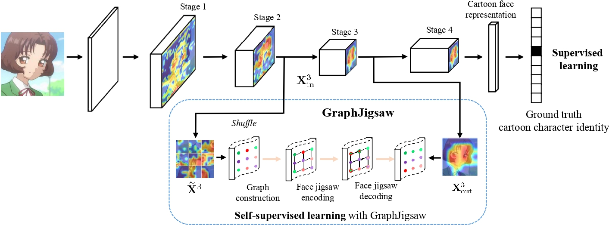

### Graph Jigsaw Learning for Cartoon Face Recognition, TIP 2022 

Cartoon face recognition is challenging as they typically have smooth color regions and emphasized edges, the key to recognizing cartoon faces is to precisely perceive their **sparse and critical shape patterns**. we propose the **GraphJigsaw** that constructs **jigsaw** puzzles at various stages in the classification network and solves the puzzles with the **graph convolutional network (GCN)** progressively.  **GraphJigsaw** significantly enhance the Cartoon face recognition accuracy with **no extra manual annotation during training** and **no extra computation burden during inference**.  We hope **GraphJigsaw** will shed light on understanding and improving the performance of cartoon face recognition.



* Main idea of GraphJigsaw. $\mathbf{X}^3_{\text{in}}$  and  $\mathbf{X}^3_{\text{out}}$ denote the input and output of the third stage in the backbone network. GraphJigsaw takes $\mathbf{X}^3_{\text{in}}$ as input and constructs a shuffled graph, then  solves the jigsaw puzzle in the face graph encoding and decoding process. GraphJigsaw can be incorporated in each stage in the backbone network in a top-down manner, thus the valuable shape patterns of the input cartoon faces can be reserved in the early stages and strengthened in the later stages gradually*


### Prerequisites
- Python 2.x
- Pytorch 0.4.x or above


### If you use this code in your paper, please cite the following:
```
@ARTICLE{9786555,
  author={Li, Yong and Lao, Lingjie and Cui, Zhen and Shan, Shiguang and Yang, Jian},
  journal={IEEE Transactions on Image Processing}, 
  title={Graph Jigsaw Learning for Cartoon Face Recognition}, 
  year={2022},
  volume={31},
  number={},
  pages={3961-3972},
  doi={10.1109/TIP.2022.3177952}
  }
```

